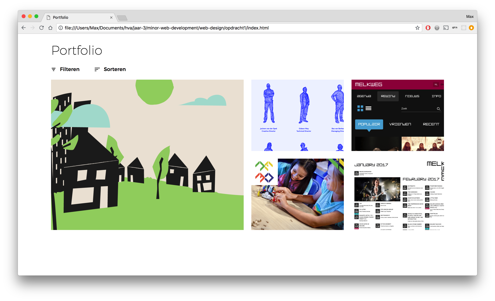
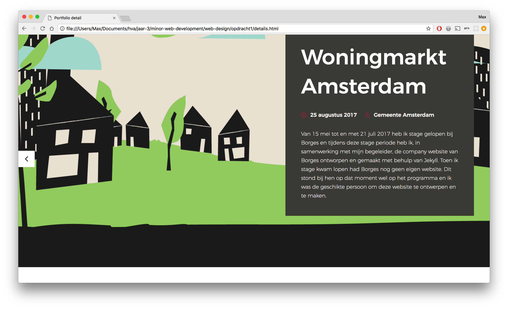
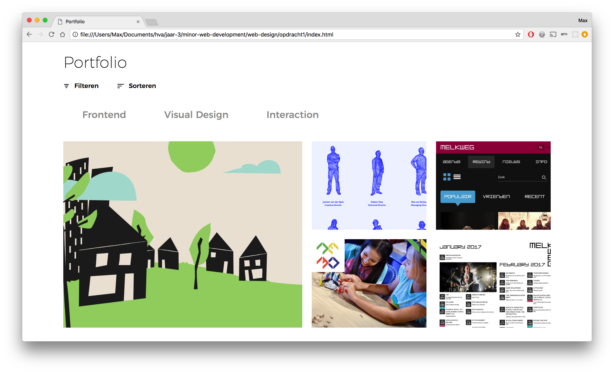

# Portfolio

[Demo](https://vriesm060.github.io/web-design/opdracht1/)

This is a first design of my portfolio website, meant as a use case to show design principles, as described by Joshua Porter in his article [Principles of User Interface Design](http://bokardo.com/principles-of-user-interface-design/).

This portfolio page features projects I worked on.

## Features

* [x] Filter option
* [x] Sorting option
* [x] Detail view of portfolio item

## Principles of User Interface Design

The following principles are included:

* [x] **#06:** [One primary action per screen](#06-one-primary-action-per-screen)
* [x] **#11:** [Strong visual hierarchies work best](#11-strong-visual-hierarchies-work-best)
* [x] **#14:** [Progressive disclosure](#14-progressive-disclosure)

### #06: One primary action per screen
---

The one primary action on the homepage is clicking one of the portfolio items to view in the detail page. This action is obvious as the portfolio items are the biggest thing on the screen.

### #11: Strong visual hierarchies work best
---

Although the homepage also features strong visual hierarchy, the detail page is the best example of this principle. The portfolio item preview covers the entire width of the screen, which results in a strong visual hierarchy.

### #14: Progressive disclosure
---

The principle of progressive disclosure can be found in the filter and sorting options at the top of the homepage. When you click on one of them, the options open up and push the portfolio items down. It does this with a nice transition so it catches your eye.
