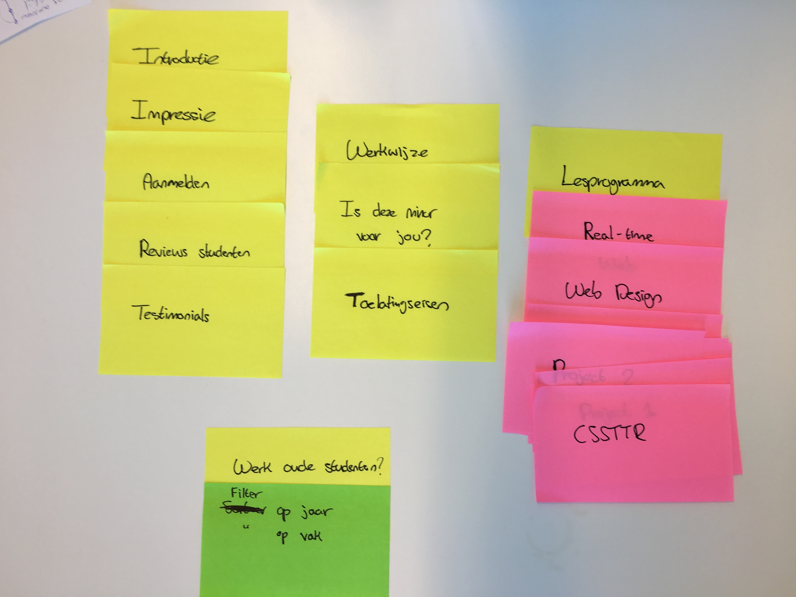
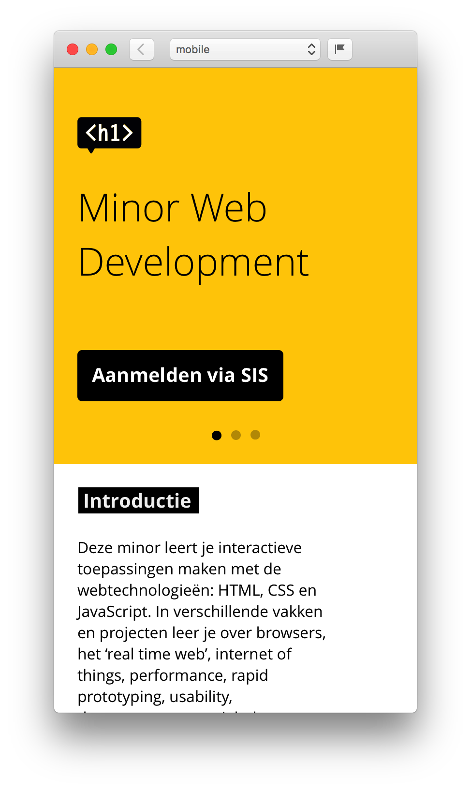
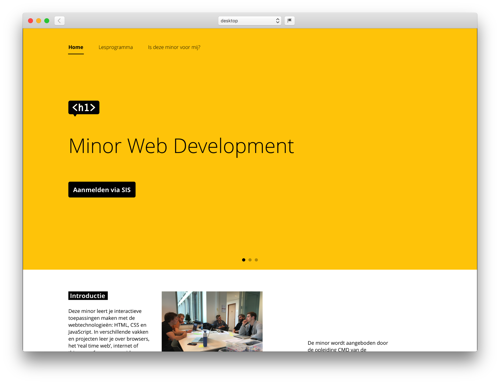
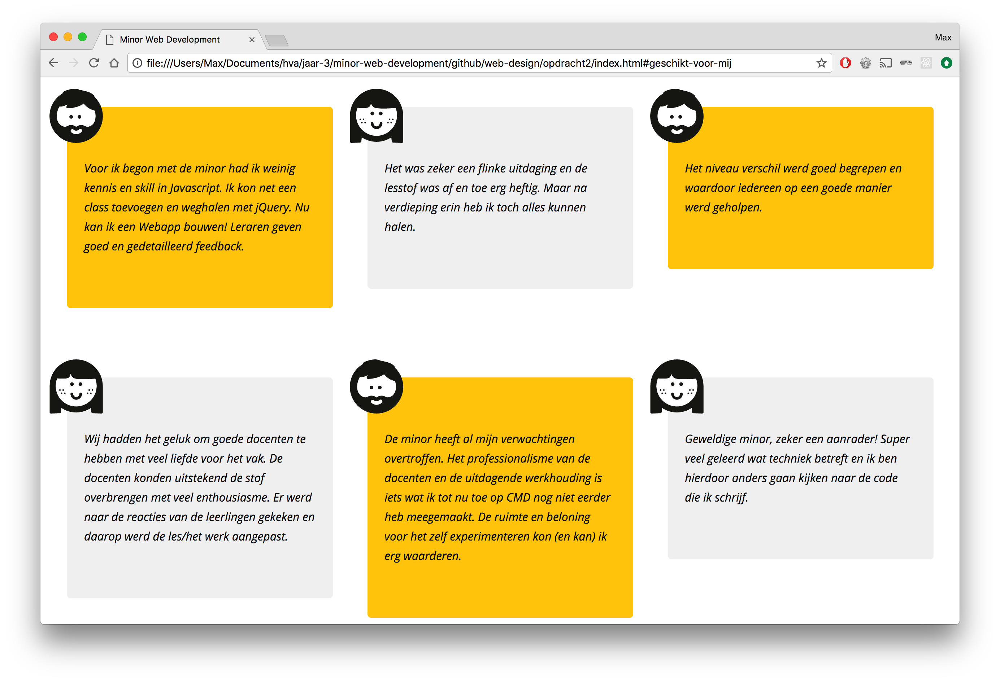
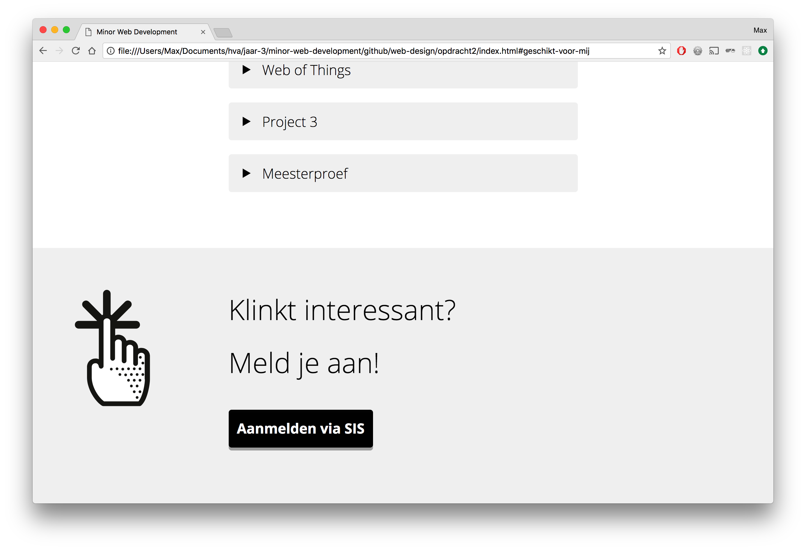

# Minor Web Development Website

<!-- Brief description of the project. What is it about? -->

[Demo](https://vriesm060.github.io/web-design/opdracht2/)

## Inhoud

* [Feedback](#feedback)
* [User Scenario's](#user-scenarios)
* [Werkwijze](#werkwijze)
* [Eindoplevering](#eindoplevering)
* [Features](#features)
* [Accessibility](#accessibility)
* [Feedback na testen](#feedback-na-testen)

## Feedback

| Feedback | Verbetering |
| -------- | ----------- |
| Beantwoord geen vraag. Maakt de flow voor een gebruiker niet af. | [Gedaan](#) |
| Geen UI Principles besproken | [Gedaan](#) |
| README onvolledig | Gedaan |

## User Scenario's

### Larissa
---

Larissa is blind en vindt het daarom belangrijk dat de website een goede structuur kent. Het is voor haar belangrijk dat de informatie en interactie goed gelabeld is zodat zij begrijpt waar ze is, wat ze kan doen en tot welke informatie ze toegang kan krijgen.

### Student van buiten CMD, geïnteresseerd in de minor
---

Een student die geïnteresseerd is in de minor Web Development komt naar de website om informatie te vinden over de minor. Deze student wil graag weten van studenten die deze minor hebben gevolgd wat zij er van vonden en of deze minor geschikt is voor hem/haar.
Wanneer deze student het gevoel heeft dat deze minor perfect is om te volgen, moet hij/zij zich kunnen aanmelden en weten hoe dit proces gaat.

## Werkwijze

### Card Sorting
---

<!-- Uitleggen ontwerpkeuzes -->

<!-- Info over card sorting -->

### Eerste Ontwerpen
---

<!-- Info over eerste ontwerpen -->

**Mobiel:**

**Desktop:**

### Redesign
---

<!-- Info over redesign -->

## Eindoplevering

<!-- Beschrijf hoe de content en flow past bij mijn user scenario's -->

Ik heb het onderwerp van de website gericht op de student die wilt weten of deze minor geschikt is voor hem/haar. Vandaar dat ik het woord 'mij' veel gebruik, om het zo persoonlijk mogelijk te houden.

De meningen van oud studenten van de minor is een belangrijk onderdeel in mijn website.

Wanneer je langs alle informatie gekomen bent en je het een leuke en interessante minor vindt, kan je gaan aanmelden via SIS.

### Principles of User Interface Design
---

## Features

<!-- What makes your project stand out? -->

## Accessibility

Larissa gaf aan dat het voor haar belangrijk is dat knoppen en links los van de context nog steeds goed te begrijpen zijn, aangezien zij op deze manier een website navigeert. Knoppen als 'lees meer' zijn voor haar zeer onduidelijk. Vandaar dat ik bij mijn knoppen 'Ontdek!' en 'Aanmelden via SIS' een visueel verborgen `` heb ingebouwd die context geeft aan de knoppen.

## Feedback na testen

* Tijdens het testen was het menu niet goed bereikbaar met de TAB toets op Google Chrome. Hij deed het echter wel goed op Firefox. Larissa gaf aan dat dit een probleem is die wel vaker voorkomt met de JAWS screenreader.

* De 'Ontdek!' knop was niet klikbaar.

* Het aanmelden voor de minor was haar gelukt (los van SIS).

* Wat minder duidelijk voor haar was de lijst aan vakken. Bij de titels was het voor haar niet duidelijk dat dit om vakken ging.
