# Minor Web Development Website

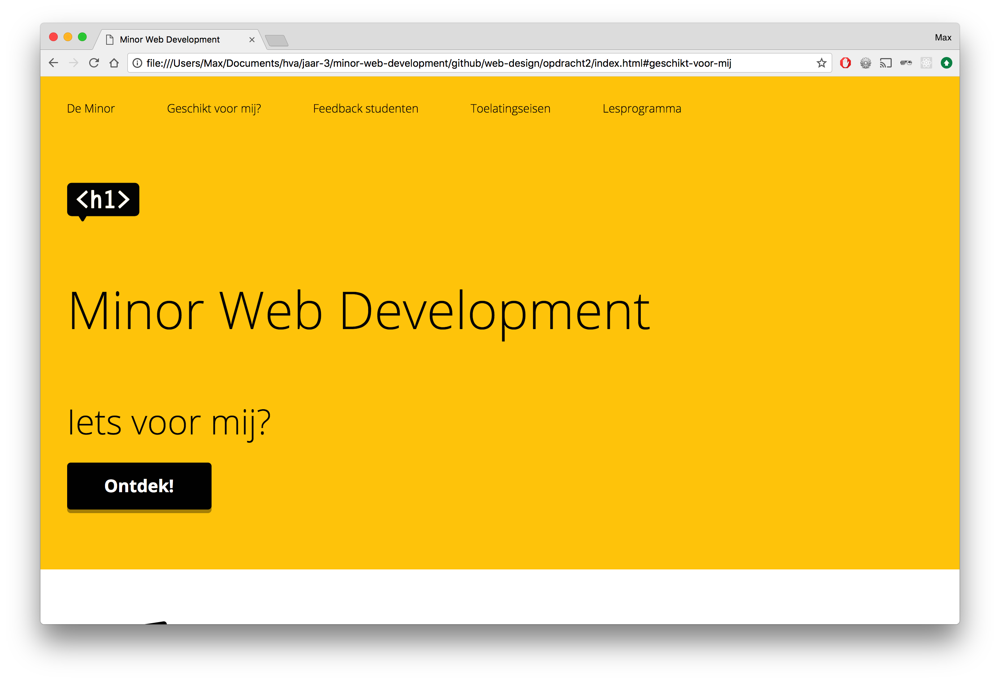

Voor het vak Web Design heb ik een herontwerp gemaakt voor de website van de Minor Web Development. Dit ontwerp is speciaal bedoelt voor studenten van buiten de opleiding Communication and Multimedia Design (CMD) waarbinnen de minor gegeven wordt en voor Larissa, die blind is en de website via toetsenbord moet besturen.

[Demo](https://vriesm060.github.io/web-design/opdracht2/)

## Inhoud

* [Feedback](#feedback)
* [User Scenario's](#user-scenarios)
* [Werkwijze](#werkwijze)
* [Eindoplevering](#eindoplevering)
* [Accessibility](#accessibility)
* [Feedback na testen](#feedback-na-testen)

## Feedback

| Feedback | Verbetering |
| -------- | ----------- |
| Beantwoord geen vraag. Maakt de flow voor een gebruiker niet af. | [Gedaan](#) |
| Geen UI Principles besproken | [Gedaan](#) |
| README onvolledig | Gedaan |

## User Scenario's

### Larissa
---

Larissa is blind en vindt het daarom belangrijk dat de website een goede structuur kent. Het is voor haar belangrijk dat de informatie en interactie goed gelabeld is zodat zij begrijpt waar ze is, wat ze kan doen en tot welke informatie ze toegang kan krijgen.

### Student van buiten CMD, geïnteresseerd in de minor
---

Een student buiten de opleiding CMD heeft interesse in User Interface Design en Interaction Design, maar wilt graag leren hoe hij/zij dit technisch kan toepassen. Hij/zij heeft al enige ervaring met HTML en CSS, maar verder nog niet veel technische kennis. Hij/zij wilt graag weten of deze minor geschikt is om dit te leren.

## Werkwijze

### Card Sorting
---

Het eerste waar ik mee begon, was Card Sorting, waarbij ik alle onderwerpen die ik aan bod wilde laten komen in de website opschreef op een sticky note, om vervolgens te gaan kijken hoe ik deze onderwerpen kon sorteren. Hiermee kreeg ik een goed overzicht van de inhoud van de website.

**Eerste Card Sorting sessie:**
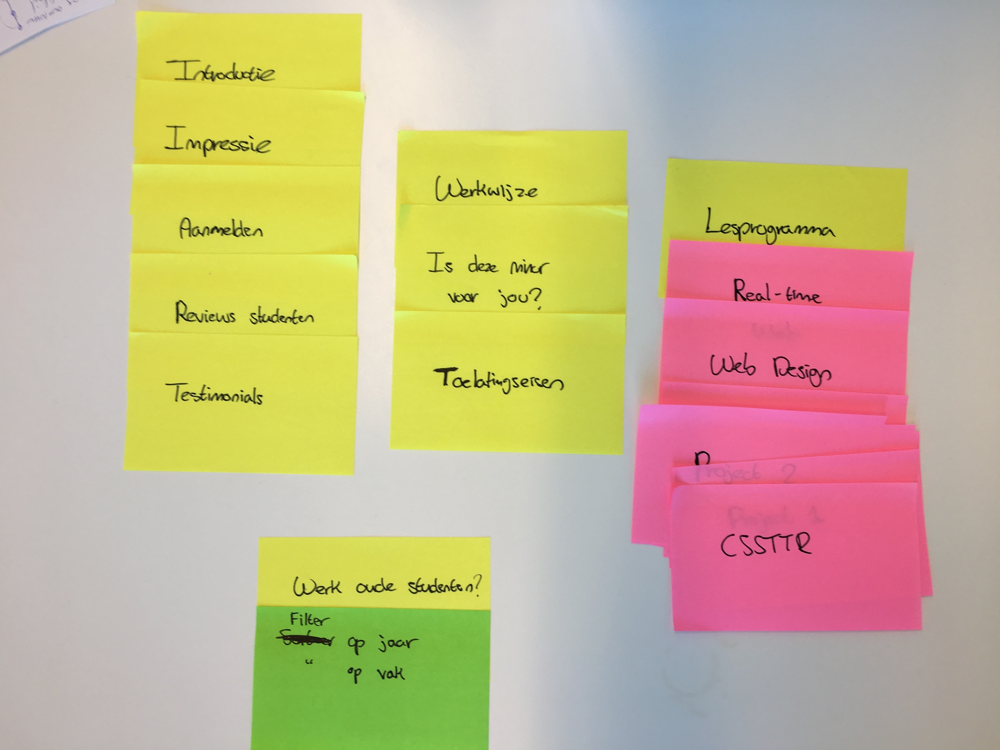

Voor de redesign van de website heb ik een nieuwe Card Sorting sessie gehouden.

**Tweede Card Sorting sessie:**
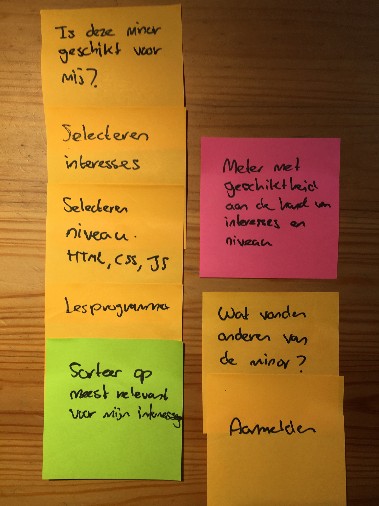

### Eerste Ontwerp
---

De eerste ontwerpen gaven een basis voor de stijl van de website. Dit ontwerp gaf alle huidige informatie weer in een nieuwe stijl, waarbij de focus lag op het aanmelden voor de minor. Vandaar dat de aanmeldknop veel aandacht krijgt.

**Mobiel:**
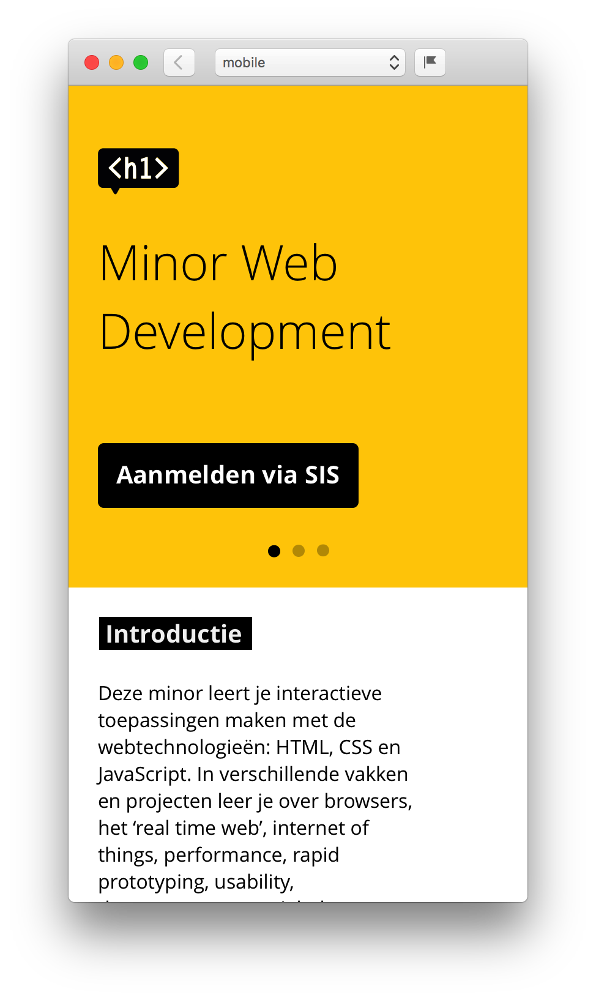

**Desktop:**
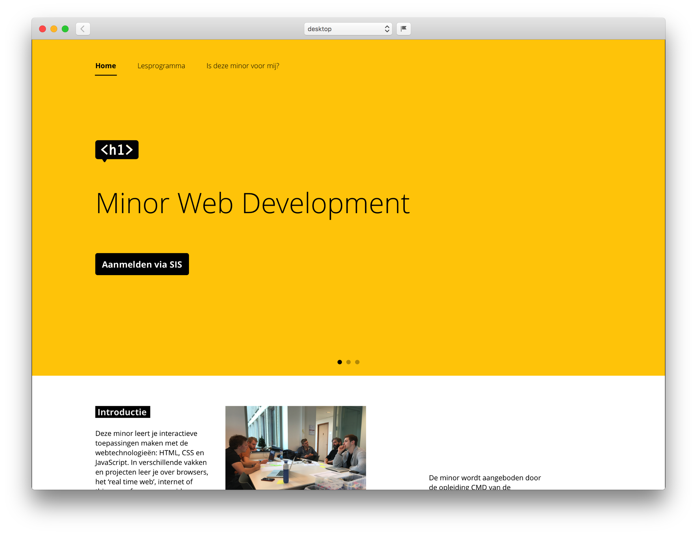

### Redesign
---

Bij het tweede ontwerp lag de focus veel meer op de student die geïnteresseerd is in de minor. Bij dit ontwerp is het belangrijk dat de website persoonlijk is. Vandaar de vraag: "Iets voor mij?". Zo spreekt het meer aan en geeft het meer het gevoel dat je kan ontdekken of deze minor wel iets voor je is.

**Mobiel:**
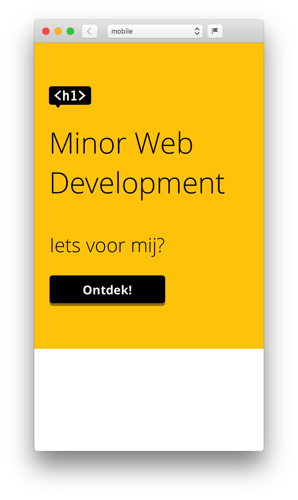

**Desktop:**
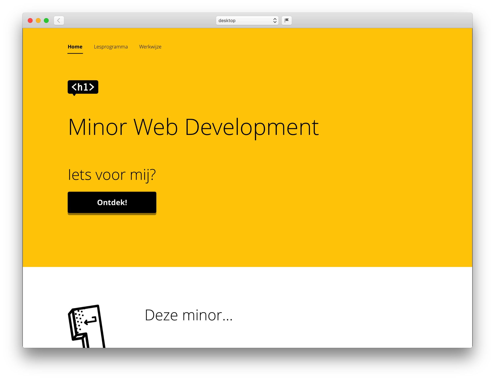

## Eindoplevering

Ik heb het onderwerp van de website gericht op de student die wilt weten of deze minor geschikt is voor hem/haar. Vandaar dat ik het woord 'mij' veel gebruik, om het zo persoonlijk mogelijk te houden.

Als je binnenkomt op de website, krijg je de vraag: "Iets voor mij?" en de bijbehorende knop "Ontdek". Deze vraag is wat een student buiten CMD graag beantwoord wil hebben en waar de website vervolgens ook voor moet zorgen.

### Kleine introductie
---

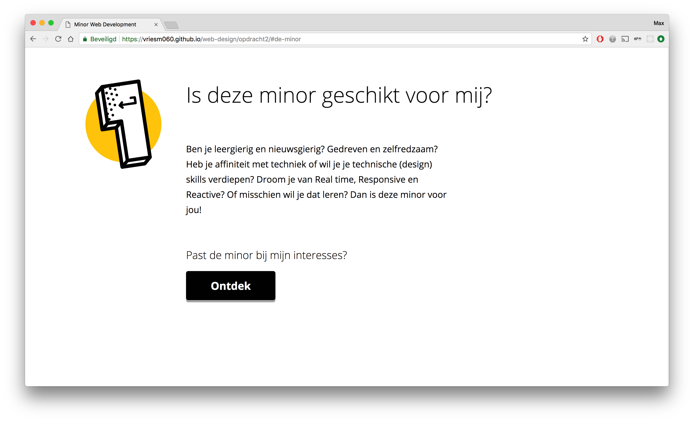

Wanneer je op de knop "Ontdek" klikt kom je bij een kleine introductie over de minor, waarbij je opnieuw iets specifiekere vraag krijgt: "Past de minor bij mijn interesses?". Het is hierna namelijk de bedoeling om je interesses met betrekking tot de minor aan te geven, om zo te kijken of jij bij de minor past en de minor bij jou.

### Ik ben geïnteresseerd in...

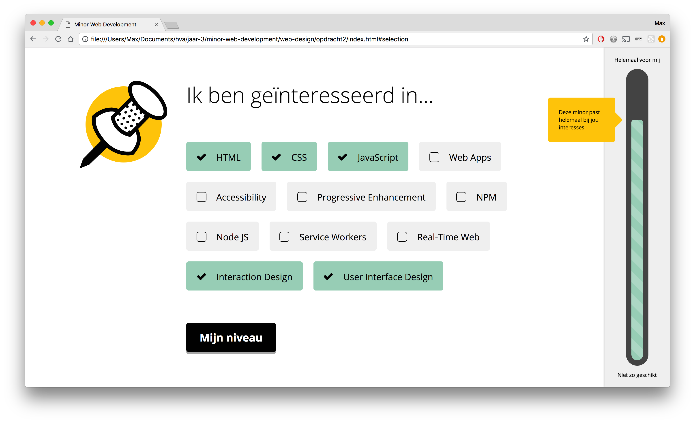

Wanneer je verder gaat begint het beantwoorden van de vraag: "Is deze minor iets voor mij?". Op deze sectie moet je namelijk jouw interesses aanvinken in een lijst met onderwerpen die binnen de minor behandeld worden.

Wanneer je een onderwerp selecteert verschijnt er rechts in beeld een meter die aangeeft in hoeverre de minor voor jouw geschikt is wanneer je jouw interesses invult. Deze meter geeft ook feedback aan de student over de geselecteerde interesses en hoe deze zich weerhoudt tot de inhoud van de minor.

Er zijn verschillende combinaties van onderwerpen mogelijk die aangeven dat je geschikt bent voor de minor. Je hoeft bijvoorbeeld echt niet alleen maar technische interesses te hebben. Een paar zijn al voldoende.

De onderwerpen en de weging van een onderwerp ten opzichte van de meter zijn bepaald aan de hand van welke onderwerpen aan bod komen tijdens de vakken. Dit geeft een eerlijke afweging over de geschiktheid van de minor. Zo weegt HTML zwaarder mee dan Real-Time Web, omdat dit bij elk vak voorkomt Real-Time Web maar bij één vak.

### Mijn niveau
---

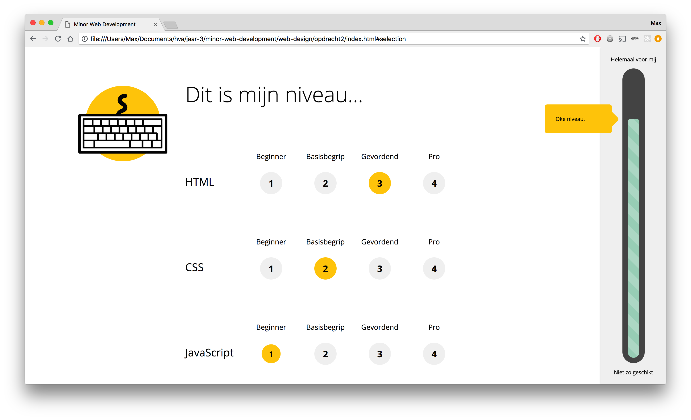

Na het invullen van jouw interesses is de volgende stap het invullen van jouw niveau met betrekking tot HTML, CSS en JavaScript. Dit is een belangrijk onderdeel voor de docenten van de minor, omdat er een gedegen kennis van HTML, CSS en JavaScript wordt verwacht van de studenten, maar ook voor de student zelf is het belangrijk om te weten wat voor niveau geschikt is voor de minor.

Het invullen van het niveau heeft nog een klein effect op de meter. Bij een slecht niveau zal de meter iets dalen, bij een uitstekend niveau iets stijgen. Dit is ook zinvol wanneer je bij interesses bijvoorbeeld geen HTML of CSS hebt ingevuld, maar meer specifieke interesses, zoals Real-Time Web, en de meter nog niet zo vol is. Dan zie je dat bij het invullen van het niveau de meter alsnog zal stijgen wanneer je al een uitstekende basiskennis hebt.

### Vakken en meningen studenten
---

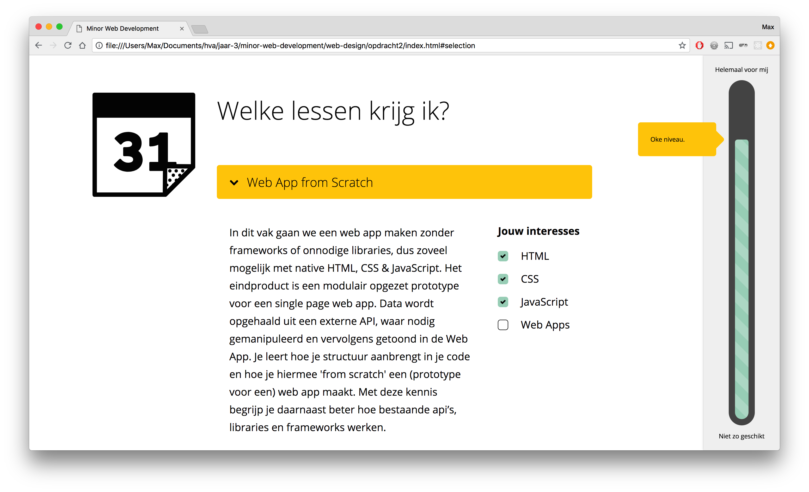

Nadat je alles hebt ingevuld kan je nog een beeld krijgen van de verschillende vakken die gegeven worden tijdens de minor. Bij elk vak kan je zien welke van de door jou ingevulde interesses worden behandeld.

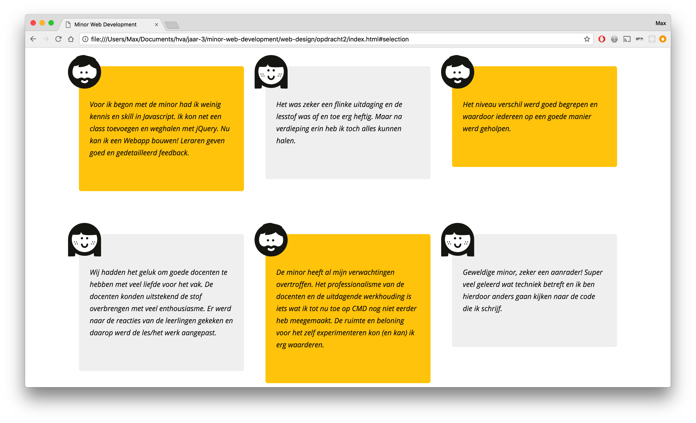

Ook kan je meningen van oud studenten van de minor lezen om een nog betere indruk te krijgen.

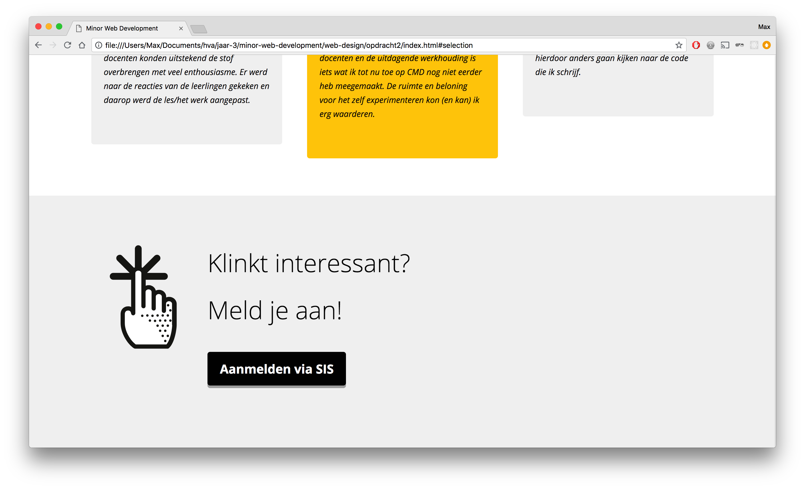

Wanneer je langs alle informatie gekomen bent en je het een leuke en interessante minor vindt, kan je gaan aanmelden via SIS.

### Principles of User Interface Design
---

Deze Principles of User Interface Design komen voor in de website:

* **02:** Interfaces exist to enable interaction
* **04:** Keep users in control
* **06:** One primary action per screen
* **08:** Provide a natural next step
* **10:** Consistency matters
* **11:** Strong visual hierarchies work best
* **14:** Progressive disclosure

## Accessibility

Larissa gaf aan dat het voor haar belangrijk is dat knoppen en links los van de context nog steeds goed te begrijpen zijn, aangezien zij op deze manier een website navigeert. Knoppen als 'lees meer' zijn voor haar zeer onduidelijk. Vandaar dat ik bij mijn knoppen 'Ontdek' en 'Aanmelden via SIS' een visueel verborgen `<span>` heb ingebouwd die context geeft aan de knoppen.

```
<a class="action-button" href="#de-minor" role="button">Ontdek<span class="screenreader">deze minor</span></a>
```

Een uitdaging voor deze website was om niet visueel aan te kunnen geven of jij geschikt bent voor deze minor. Ik heb besloten om de feedback berichten die getoont worden wanneer je een interesse of niveau aangeeft voor te laten lezen door de screenreader. Dit heb ik voor elkaar gekregen door via JavaScript deze feedback teksten als visueel verborgen `<span>` in de `<label>` van de geselecteerde checkbox of radiobutton te stoppen. Hierdoor noemt de screenreader dit op na het aanvinken en krijg je dus elke keer je feedback te horen.

```
<label for="html">
  HTML
  <span class="screenreader">Geschikt voor mij? Alleen HTML en/of CSS</span>
</label>
```

## Feedback na testen

* Tijdens het testen was het menu niet goed bereikbaar met de TAB toets op Google Chrome. Hij deed het echter wel goed op Firefox. Larissa gaf aan dat dit een probleem is die wel vaker voorkomt met de JAWS screenreader.

* De 'Ontdek!' knop was niet klikbaar.

* Het aanmelden voor de minor was haar gelukt (los van SIS).

* Wat minder duidelijk voor haar was de lijst aan vakken. Bij de titels was het voor haar niet duidelijk dat dit om vakken ging.
