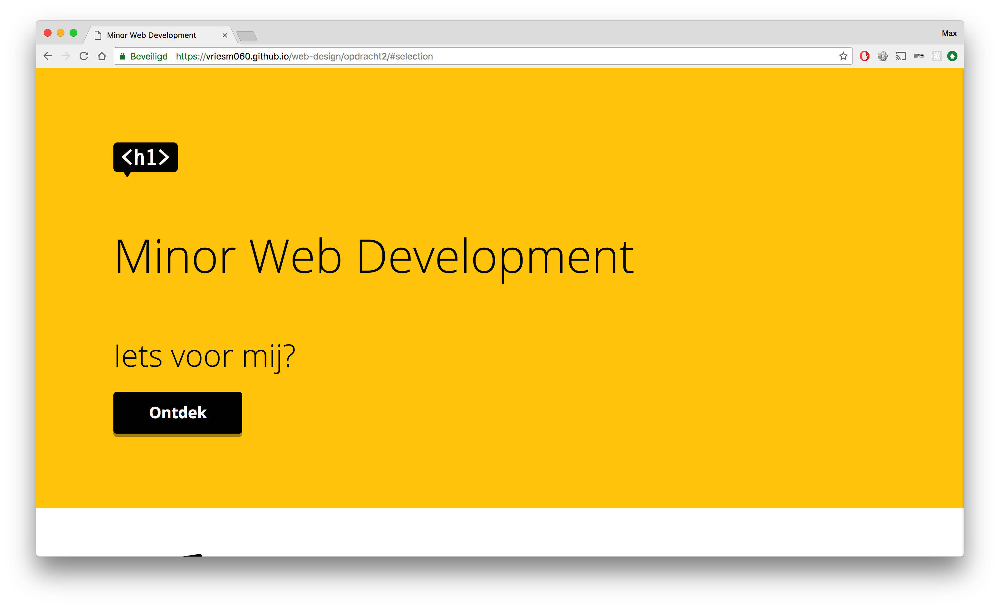

# Minor Web Development Website

Voor het vak Web Design heb ik een herontwerp gemaakt voor de website van de Minor Web Development. Dit ontwerp is speciaal bedoelt voor studenten van buiten de opleiding Communication and Multimedia Design (CMD) waarbinnen de minor gegeven wordt en voor Larissa, die blind is en de website via toetsenbord moet besturen.

[Demo](https://vriesm060.github.io/web-design/opdracht2/)

## Inhoud

* [Feedback](#feedback)
* [User Scenario's](#user-scenarios)
* [Werkwijze](#werkwijze)
* [Eindoplevering](#eindoplevering)
* [Features](#features)
* [Accessibility](#accessibility)
* [Feedback na testen](#feedback-na-testen)

## Feedback

| Feedback | Verbetering |
| -------- | ----------- |
| Beantwoord geen vraag. Maakt de flow voor een gebruiker niet af. | [Gedaan](#) |
| Geen UI Principles besproken | [Gedaan](#) |
| README onvolledig | Gedaan |

## User Scenario's

### Larissa
---

Larissa is blind en vindt het daarom belangrijk dat de website een goede structuur kent. Het is voor haar belangrijk dat de informatie en interactie goed gelabeld is zodat zij begrijpt waar ze is, wat ze kan doen en tot welke informatie ze toegang kan krijgen.

### Student van buiten CMD, geïnteresseerd in de minor
---

Een student buiten de opleiding CMD heeft interesse in User Interface Design en Interaction Design, maar wilt graag leren hoe hij/zij dit technisch kan toepassen. Hij/zij heeft al enige ervaring met HTML en CSS, maar verder nog niet veel technische kennis. Hij/zij wilt graag weten of deze minor geschikt is om dit te leren.

## Werkwijze

### Card Sorting
---

Het eerste waar ik mee begon, was Card Sorting, waarbij ik alle onderwerpen die ik aan bod wilde laten komen in de website opschreef op een sticky note, om vervolgens te gaan kijken hoe ik deze onderwerpen kon sorteren. Hiermee kreeg ik een goed overzicht van de inhoud van de website.

**Eerste Card Sorting sessie:**

Voor de redesign van de website heb ik een nieuwe Card Sorting sessie gehouden.

**Tweede Card Sorting sessie:**

### Eerste Ontwerp
---

De eerste ontwerpen gaven een basis voor de stijl van de website. Dit ontwerp gaf alle huidige informatie weer in een nieuwe stijl, waarbij de focus lag op het aanmelden voor de minor. Vandaar dat de aanmeldknop veel aandacht krijgt.

**Mobiel:**

**Desktop:**

### Redesign
---

Bij het tweede ontwerp lag de focus veel meer op de student die geïnteresseerd is in de minor. Bij dit ontwerp is het belangrijk dat de website persoonlijk is. Vandaar de vraag: "Iets voor mij?". Zo spreekt het meer aan en geeft het meer het gevoel dat je kan ontdekken of deze minor wel iets voor je is.

**Mobiel:**

**Desktop:**

## Eindoplevering

<!-- Beschrijf hoe de content en flow past bij mijn user scenario's -->

Ik heb het onderwerp van de website gericht op de student die wilt weten of deze minor geschikt is voor hem/haar. Vandaar dat ik het woord 'mij' veel gebruik, om het zo persoonlijk mogelijk te houden.

Als je binnenkomt op de website, krijg je de vraag: "Iets voor mij?" en de bijbehorende knop "Ontdek". Deze vraag is wat een student buiten CMD graag beantwoord wil hebben en waar de website vervolgens ook voor moet zorgen.

De meningen van oud studenten van de minor is een belangrijk onderdeel in mijn website.

Wanneer je langs alle informatie gekomen bent en je het een leuke en interessante minor vindt, kan je gaan aanmelden via SIS.

### Principles of User Interface Design
---

## Features

<!-- What makes your project stand out? -->

## Accessibility

Larissa gaf aan dat het voor haar belangrijk is dat knoppen en links los van de context nog steeds goed te begrijpen zijn, aangezien zij op deze manier een website navigeert. Knoppen als 'lees meer' zijn voor haar zeer onduidelijk. Vandaar dat ik bij mijn knoppen 'Ontdek!' en 'Aanmelden via SIS' een visueel verborgen `` heb ingebouwd die context geeft aan de knoppen.

## Feedback na testen

* Tijdens het testen was het menu niet goed bereikbaar met de TAB toets op Google Chrome. Hij deed het echter wel goed op Firefox. Larissa gaf aan dat dit een probleem is die wel vaker voorkomt met de JAWS screenreader.

* De 'Ontdek!' knop was niet klikbaar.

* Het aanmelden voor de minor was haar gelukt (los van SIS).

* Wat minder duidelijk voor haar was de lijst aan vakken. Bij de titels was het voor haar niet duidelijk dat dit om vakken ging.
